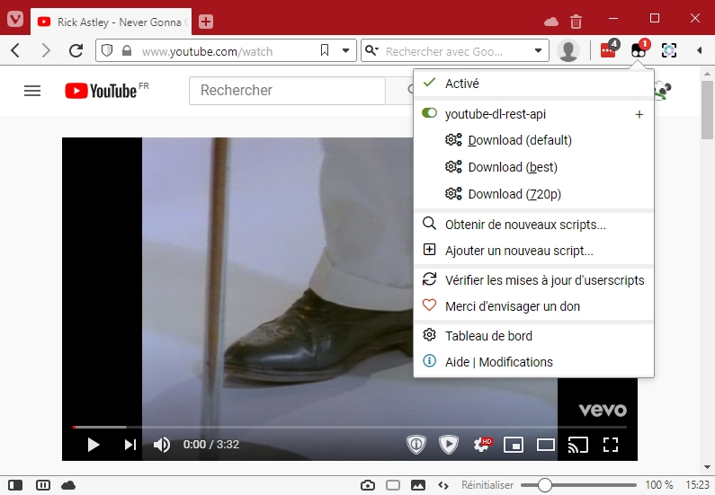

# Simple youtube-dl rest API (ydl_api)

### Exhaustive list of the ydl_api features
- Launch youtube-dl download directly on your server
  - Choice your video format
  - Download subtitles
  
### Disclaimer
This is my very first python program. I did my best. If you are an experienced python developer, you may not want to look at the source code. (I'm kidding, you're going to have to configure some things anyway).

### Files
* `readme.md`
* `main.py` the main program
* `params.py`
* `launch.sh` a simple sh file to launch the server
* `userscript.js` a javascript file you can import in [Greasemonkey (firefox)](https://addons.mozilla.org/fr/firefox/addon/greasemonkey/) or [Tampermonkey (chrome)](https://chrome.google.com/webstore/detail/tampermonkey/dhdgffkkebhmkfjojejmpbldmpobfkfo?hl=fr) to access the api from yout browser
* `ydl_api.service` a systemd service file

### Dependancies
* Installation with distribution package manager (`apt`, `yum`, ...) : `python3`, `python3-pip`, `ffmpeg`
* Installation with pip : `fastapi`, `uvicorn`, `youtube-dl`

```
pip3 install fastapi youtube-dl uvicorn
``` 

### Installation
#### Download this repo
Download this git repository using git command or download the zip with wget command. Then unzip the content where you want.

#### Replace placeholders
Placeholders looks like this : `---%--- REPLACE ---%---`
* (Optional) `params.py` : you can change destination folder, file name template and a few others options
* (Optional) `userscript.js` : you must set your host, you can also add format options as you want
* (Optional) `launch.sh` : the default port is set arbitrarily to `5011`. Change it as you want.
* (Optional) `ydl_api.service` : you must set the working directory to the directory you downloaded this application. If you don't want change default user and group, you can delete those lines :

```
# (Optional, default='root') Enter here the user and group you want
User=---%--- REPLACE ---%---
Group=---%--- REPLACE ---%---
```

#### Install as daemon
Just move `ydl_api.service` in `/usr/lib/systemd/system/` for `systemd` linux.

```
mv ydl_api.service /usr/lib/systemd/system/
```

You can change the name of the service by changing the name of the file.

then (you must run this command every time you change the service file) 

```
systemctl daemon-reload
```

To start the daemon : 
```
systemctl start ydl_api
```

To stop the daemon : 
```
systemctl stop ydl_api
```

To start the daemon on boot : 
```
systemctl enable ydl_api
```

To NOT start the daemon on boot : 
```
systemctl disable ydl_api
```

#### Install the userscript
Install [Greasemonkey (firefox)](https://addons.mozilla.org/fr/firefox/addon/greasemonkey/) or [Tampermonkey (chrome)](https://chrome.google.com/webstore/detail/tampermonkey/dhdgffkkebhmkfjojejmpbldmpobfkfo?hl=fr) and add a new userscript. Then copy the content of `userscript.js` in the interface and save.

You now should have access to download options on every sites.



### Use API
Simple exemple of request to use anywhere you want :

```
GET : http://%HOST%:%PORT%/download?url=https://www.youtube.com/watch?v=dQw4w9WgXcQ&format=best[height=720]/best&subtitles=fr,en&location=date
```

Parameters :
* `url` : the page to download
* (optional) `format` : the format of the video you want, if not provided, default value = `params.default_format`. TODO : verify in the API if the format is correct
* (optional) `subtitles` : the list of subtitles you want to download. Can not download generated subtitles. If not provided, default value = `params.default_subtitles_languages`
* (optional) `location` : the identifier of the location you want to use. Set in `params.download_dir`. If not provided, default value = `default`

### ios shortcut
Find here the shortcut created to use with ydl_api : [https://www.icloud.com/shortcuts/f2719de8ea47404594a09cd1bcdc5d48](https://www.icloud.com/shortcuts/f2719de8ea47404594a09cd1bcdc5d48)

Only the `url` is provided to the api. All other fields uses default values of the server.
